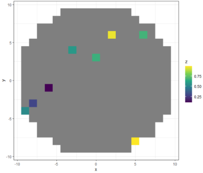
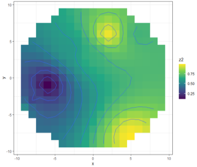

```R
set.seed(99)

#generate a wafer map bound by radius of 10 consists of number of 1x1 dice
x <- rep(-10:10, 21)
y <- rep(-10:10, each=21)
r <- sqrt(x^2+y^2)

df <- data.frame(x, y, r)
df <- df[which(df$r<10), ]

#generate random data of 8 random dice on the wafer
df$z <- NA 
df$z[sample(1:nrow(df), 8)] <- runif(8)

library(ggplot2)

ggplot(df, aes(x = x, y = y, z = z, fill = z)) + 
  geom_tile() + #or use geom_raster()
  geom_contour() + 
  scale_fill_continuous(type = 'viridis') + 
  theme_bw()

```



```R
#interpolate missing values
test <- df[is.na(df$z), ]
train <- df[!is.na(df$z), ]

library(gstat)
#IDW (inverse distance weighted)
#~1 meaning use intercept only (e.g. x+y)
gscv <- gstat(formula=z~1, location=~x+y, data=train)
p <- predict(gscv, test)$var1.pred

df$z2 <- df$z
df$z2[is.na(df$z)] <- p

ggplot(df, aes(x, y, z = z2, fill = z2)) + 
  geom_tile() +
  geom_contour() +
  scale_fill_continuous(type = 'viridis') +
  theme_bw()
```



```R
library(raster)
dxy <- df[complete.cases(df), ]

ras <- raster(x=matrix(runif(400), nrow=20, ncol=20), xmx=20, xmn=-20, ymx=20, ymn=-20)
plot(ras)

#knn k-nearest-neighbor, set 'nmax'=5, set=list(idp=0)
id <- gstat(formula=z~1, locations=~x+y, data=dxy)
ip <- raster::interpolate(ras, id)

plot(ip)
contour(ip, nlevels=10, add=T)
```


```R
library(dismo)

#k-fold cross validation

#alternative to using dismo: kf <- sample(seq_len(5), nrow(dxy), replace=T, prob=rep(1/5, 5))
kf <- dismo::kfold(nrow(dxy), k=5)

rmse <- rep(NA, 5)

for (k in 1:5) {
  test <- dxy[kf == k, ]
  train <- dxy[kf != k, ]
  
  gscv <- gstat(formula = z~1, locations = ~x+y, data=train)
  p <- predict(gscv, test)$var1.pred
  
  RMSE <- function(m, o) {
    sqrt(mean(m-o)^2)
  }
  
  rmse[k] <- RMSE(test$z, p)
}

#[1] 0.150700931 0.004024369 0.223633899 0.234800772
#[5] 0.429306499
rmse

#[1] 0.6924585
mean(rmse/sd(dxy$z))

```