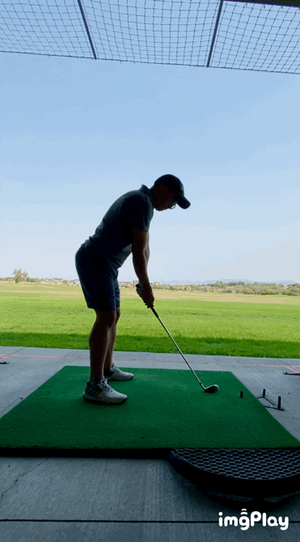

Ok, here is how my swing looks like (on a good day) at the beginning of 2021.

Summing up what I've learned in the past 9 months time from never stepping foot on a golf course or a practice range.

- The sport of golf is not for the faint of heart, that being said - it is truly addictive and fascinating especially for anyone who enjoys *self-improvement through learning, thinking and practicing*.

- *Stance and posture* are very, very important, something I've come to realization 6 months into my journey of puring my golf shot. I have the tendency to sit deep with conscious knee bent that on video is way more exaggerated than what I felt. To get to a more ideal stance and posture (for me), i always started off with a straight up stance and start tilting my upper body altogether to almost falling over without any conscious effort to bend my knees as I have the tendency to over bend them.

- *Mike Bender*, through recommendation from a friend I started to follow @mikebendergolf on IG and one of his key teaching is to release, or 'dump' in his words, at post impact. I cannot describe how much this swing thought served me in getting better at swinging a golf club, it helped me to create lag in my downswing, shallow my swing path, improve my tempo, and cure my tendency to over back swing and go cross-the-line.

- Find a teacher, or at least record yourself at practice range. It is often the case that what you feel when swinging a club is not matching up to what is actually happening, and only by looking at the video in retrospective will help you realize what is happening and where to improve. Tiger Woods once in a Taylormade produced video with Collin Morikawa mentioned that he used to see people mentioning that they feel like they are shallowing the club but in reality all he see is a steep swing path.

- Practice is a must to build muscle memory, but also like many pros and teachers would say - *mindless practice can do more harm than good*. I find myself more productive when trying to work on just one aspect at a time instead of constantly changing and searching for ways to correct or improve my swings whenever I'm at a practice range. Often times I also find that focusing on one particular club (an 8 iron for me most of the times) will be more effective way to practice, switching out many clubs in one session will kill the energy fast and bring frustrations when your swing thought of the day did not come to fruition.

- Maintain closed club face throughout the backswing the best you can if you tend to slice