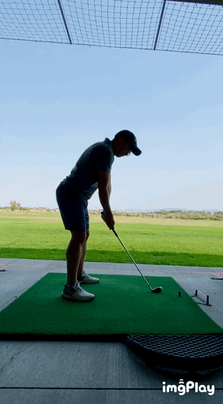
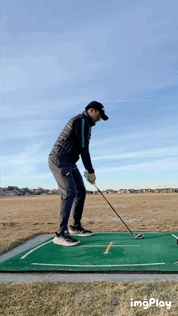

Golf is something that I picked up only during the pandemic, and now I am absolutely addicted and can only see myself playing as long as I am physically capable.

Here is one of my swings with an 8 iron from last weekend, it goes without saying that there are many aspects that need to be worked on, but I would say that it came long way from what I was doing merely 9 months ago.

Here is what my swing looks like (on a good day) at the beginning of 2021.

As the journey continues for me to find more consistency and power, here I'll try to sum up what I've learned in the past 9 months time from never swung a golf club before.

- The sport of golf is not for the faint of heart, that being said - it is truly addictive and fascinating, especially for anyone who enjoys *self-improvement through learning, thinking and practicing*.

- **Stance and posture** are very, very important, something I have unfortunately neglected 6 months into my journey to learn how to swing a golf club. I used to consciously bend my knees that on video turns out to be way more exaggerated than what I felt, instead, now I am always trying to stand tall and lean more forward. For me, in order to get to a more ideal stance and posture, I will started off with a straight up stance and start leaning my upper body forward to almost falling over without any conscious effort to bend my knees as I have the tendency to over bend them. In terms of stance, I am taking advice from Collin Morikawa from an article on Golf Digest where he discussed that he prefers a more narrower stance (shoulder width with a mid-iron), typically a wider stance will restrict hip rotations which is key to shallow the downswing, add power and consistency, and all other goodness.

- **Mike Bender**, through recommendation from a friend I started to follow @mikebendergolf on IG and one of his key insights in his teaching is to dump(release) the energy at post impact. I cannot describe how much this swing thought served me in getting better at swinging a golf club, it helped me to connect everything together, create lag in my downswing, shallow my swing path, improve my tempo, and cure my tendency to over back swing and go cross-the-line. Highly recommend anyone to follow him on IG where he posts daily contents, and to go to his camp in Orlando if you could afford to do so.

- **Find a teacher, or at very least try record yourself at a practice range**. It is often the case that what you feel is not matching up to what is actually happening, and only by examining at the video retrospectively will help you understand what is actually happening and where you should improve. Tiger Woods once in a video with Collin Morikawa mentioned that he used to see people mentioning that they feel like they are shallowing the club, but in reality all he see is a steep swing path.

- *Practice, practice, practice*. Practice will surely help build muscle memories, but also like many pros and teachers would say - **mindless practice can do more harm than good**. I find myself more productive when trying to work on just one thing at a time instead of constantly switching and searching for ways to correct or improve my swings during a single practice session. Often times I find that focusing just on one club (an 8 iron for me most of the times) is a more effective way to practice, switching out many clubs constantly will kill the energy fast and bring frustrations when your swing thought of the day did not come to fruition.

- Maintain a **closed club face** throughout the back-swing the best I could so to avoid never-ending slicing of the ball, as well as adding consistency since by maintaining a closed club face one must maintain the lead wrist position from cupping. Some PGA tour pros such as Collin Morikawa or Dustin Johnson would even go as far to add lead wrist rotation so to have an aggressively closed club face at the top of their back swings.

- Consciously aware of your **take away** and keep it wide (on a wide arc along the swing plane, not inside of), doing such will ensure body to arm connection in the back rotation. This seemingly small thing will help smooth out the whole swing and add power. Collin in a few videos mentioned the glove drill that he found extremely helpful even at his level - where you tuck a glove or towel under your lead armpit and ensure it does not fall off throughout your backswing, the purpose of this drill is to ensure that your entire body are involved in the wind up process (backswing) and not just your arms like what I was doing a few months ago.

- **Weight shift**, like *clearing of the hip*, is always mentioned as a key aspect, however it is not something I tend to think about a lot at practice, and it is one of the swing thought that is difficult to grasp and do correct especially when deliberately being worked on. At the beginning I always tend to shift my weight way too much onto my lead foot(left) which led to an unnatural swing. One key drill that I found helpful is taught by Danny Maude (YouTube) which is a relaxed, athletic swings and not thinking about where the ball would end up - swing the club in pendulum motion back and forth and take advantage of the moment of inertia to begin the back swing, through this practice my body is naturally adapted to how the sequence should be and a natural shift of weight to my trailing foot (idealy only slightly for stability and consistency reasons) instead of my lead foot will happen.

- **Swing plane**, or to keep your back and down swing paths in-plane. This is another important aspect that is hard to find a fix easily and requires many moving pieces to gel together to achieve. For me what I am actively working on is 1) to consciously feel the high point of my back swing and even stop at the top so that I don't rush by downswing, which typically will cause a inverse '8' and cause deep downswing. 2) Train myself to not go cross the line at the top (club pointing right of the target for a right-handed golfer), by either doing the wall drill (@mikebendergolf) or to stop at the top and examine my club position, I found that by feeling my trailing hand thumb pointing more backward at the top is also helping.

Being introspective about your golf is key to continuous improvement and joy, not doing so will only erode away one's love to the sport, cause frustration and literal pain through your wrist and arms! To all my birdie bodies and my eagle enthusiasts, the journey continues!