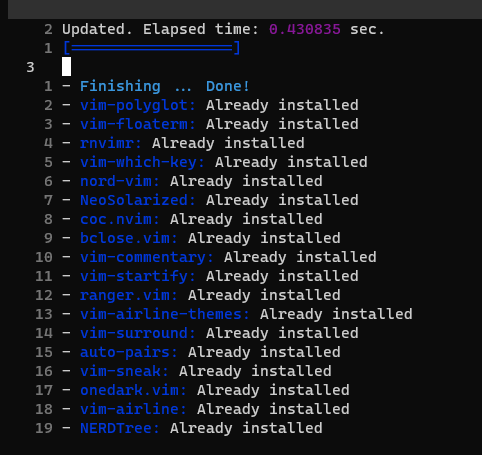

Writing up this post to serve as a personal reference and a guide for others to setup a Python oriented development environment with customized Tmux and Neovim in Linux, from scratch.

- installation

```linux
#install neovim
pi@raspberrypi:~ $sudo apt-get update
pi@raspberrypi:~ $sudo apt-get install neovim

#git curl nodejs npm are required for the plugins
pi@raspberrypi:~ $sudo apt-get install git curl nodejs npm -y

```
- check version

```linux
pi@raspberrypi:~ $ nvim -v
NVIM v0.4.4
Build type: Release
Lua 5.1
Compilation: /usr/bin/cc -g -O2 -fdebug-prefix-map=/build/neovim-AMNr6D/neovim-0.4.4=. -fstack-protector-strong -Wformat -Werror=format-security -Wdate-time -D_FORTIFY_SOURCE=1 -DDISABLE_LOG -Wdate-time -D_FORTIFY_SOURCE=1 -O2 -DNDEBUG -DMIN_LOG_LEVEL=3 -Wall -Wextra -pedantic -Wno-unused-parameter -Wstrict-prototypes -std=gnu99 -Wshadow -Wconversion -Wmissing-prototypes -Wimplicit-fallthrough -Wvla -fstack-protector-strong -fno-common -fdiagnostics-color=always -DINCLUDE_GENERATED_DECLARATIONS -D_GNU_SOURCE -DNVIM_MSGPACK_HAS_FLOAT32 -DNVIM_UNIBI_HAS_VAR_FROM -I/build/neovim-AMNr6D/neovim-0.4.4/build/config -I/build/neovim-AMNr6D/neovim-0.4.4/src -I/usr/include -I/usr/include/lua5.1 -I/build/neovim-AMNr6D/neovim-0.4.4/build/src/nvim/auto -I/build/neovim-AMNr6D/neovim-0.4.4/build/include
Compiled by team+vim@tracker.debian.org

Features: +acl +iconv +tui
See ":help feature-compile"

   system vimrc file: "$VIM/sysinit.vim"
  fall-back for $VIM: "/usr/share/nvim"

Run :checkhealth for more info
```

- setup neovim config

```linux
#pi@raspberrypi:~ $ cd ~
#pi@raspberrypi:~ $ mkdir .config/
pi@raspberrypi:~ $ cd .config/
pi@raspberrypi:~/.config $ git clone https://github.com/fjoe88/nvim.git
```

- open up neovim and install plug-ins

```linux
#pi@raspberrypi:~ $ nvim

:PlugInstall
```



- yarn install

```linux

pi@raspberrypi:~/.config/nvim $ sudo npm install -g yarn
pi@raspberrypi:~/.config/nvim $ cd plugged/
pi@raspberrypi:~/.config/nvim/plugged $ yarn install
pi@raspberrypi:~/.config/nvim/plugged $ yarn build
```

For SSH using windows terminal, install nerd-font in order to make powerline characters displayable

- goto https://www.nerdfonts.com/ and install firacode nerdfont
- open up .ttf file and install
- restart and setup terminal font to firacode nerdfont
- restart and check powerline which should display correctly
